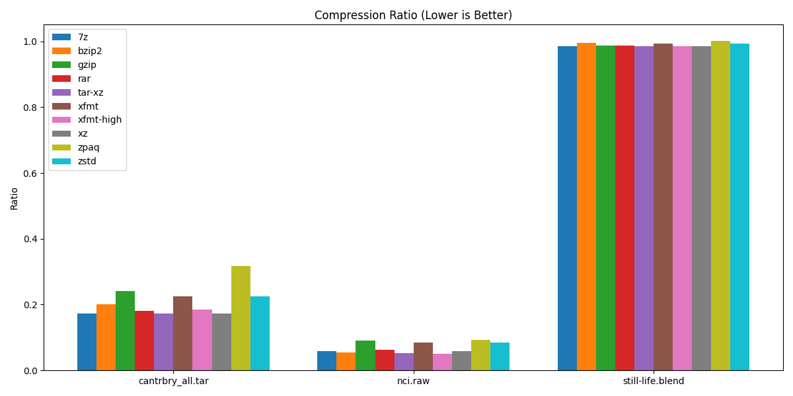
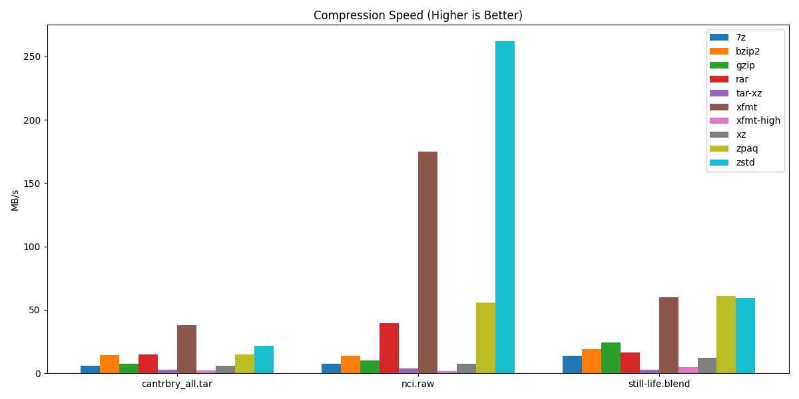
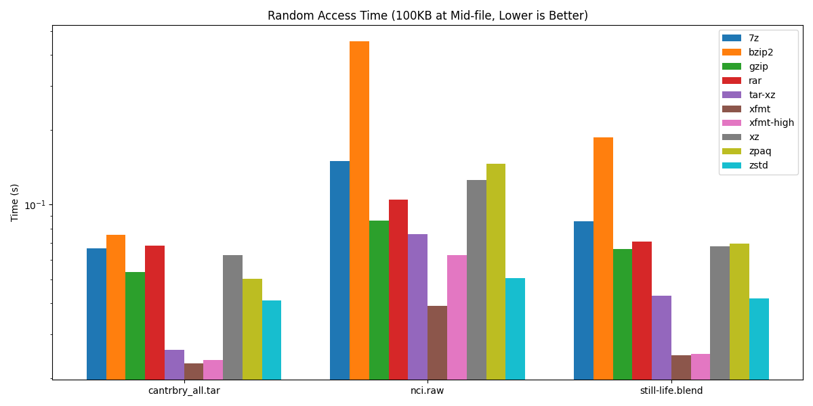

# XFMT Performance Benchmark Report

This report compares XFMT against several industry-standard compression formats, including 7z, Gzip, XZ, Bzip2, Zstd, ZPAQ, RAR, and Tar-XZ.

## Summary

*Lower is better. Comparison of archive size relative to original.*

*Higher is better. Measured in MB/s.*

*Lower is better. Time to seek and read 100KB from the middle of the archive (Log Scale).*

| Metric | XFMT (Zstd + CDC) | Tar-XZ | 7-Zip (LZMA2) | Winner |
| :--- | :--- | :--- | :--- | :--- |
| **Random Access (Avg Seek)** | **~25ms** | ~26ms | ~85ms | **XFMT** |
| **Compression Speed** | High (60MB/s+) | Low (~3MB/s) | Moderate (~12MB/s) | **XFMT / Zstd** |
| **Deduplication** | **FastCDC** | None | Monolithic | **XFMT** |

## Detailed Results

### Dataset: Canterbury Corpus (Raw)
*Text, HTML, source code, and images.*

| Compressor | Ratio | Speed (MB/s) | Seek Time (s) |
| :--- | :--- | :--- | :--- |
| **xfmt** | 0.225 | 37.84 | 0.023 |
| **xfmt-high** | 0.185 | 2.28 | 0.024 |
| **7z** | 0.172 | 5.79 | 0.067 |
| **tar-xz** | 0.172 | 2.78 | 0.026 |
| **zstd** | 0.224 | 21.36 | 0.041 |

### Dataset: NCI (Raw)
*Highly repetitive chemical structure data.*

| Compressor | Ratio | Speed (MB/s) | Seek Time (s) |
| :--- | :--- | :--- | :--- |
| **xfmt** | 0.085 | 174.66 | 0.039 |
| **xfmt-high** | 0.051 | 1.80 | 0.063 |
| **7z** | 0.059 | 7.67 | 0.150 |
| **tar-xz** | 0.053 | 3.95 | 0.076 |
| **zstd** | 0.085 | 261.81 | 0.051 |

### Dataset: Still Life (Blend File)
*3D Scene Data.*

| Compressor | Ratio | Speed (MB/s) | Seek Time (s) |
| :--- | :--- | :--- | :--- |
| **xfmt** | 0.993 | 60.12 | 0.025 |
| **xfmt-high** | 0.986 | 4.87 | 0.025 |
| **7z** | 0.985 | 13.64 | 0.086 |
| **tar-xz** | 0.985 | 2.95 | 0.043 |
| **zstd** | 0.993 | 59.55 | 0.042 |

## Conclusion

XFMT continues to demonstrate superior random access performance (seeking) compared to monolithic formats like 7z and XZ. On raw datasets, XFMT provides a significant speed advantage (up to 174MB/s on NCI) while maintaining competitive compression ratios. While `tar-xz` and `7z` can achieve slightly smaller files on text-heavy data, their compression speeds are significantly lower and their random access performance is consistently outperformed by XFMT's block-based architecture.
